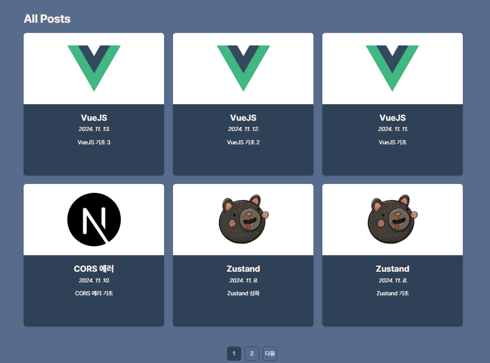
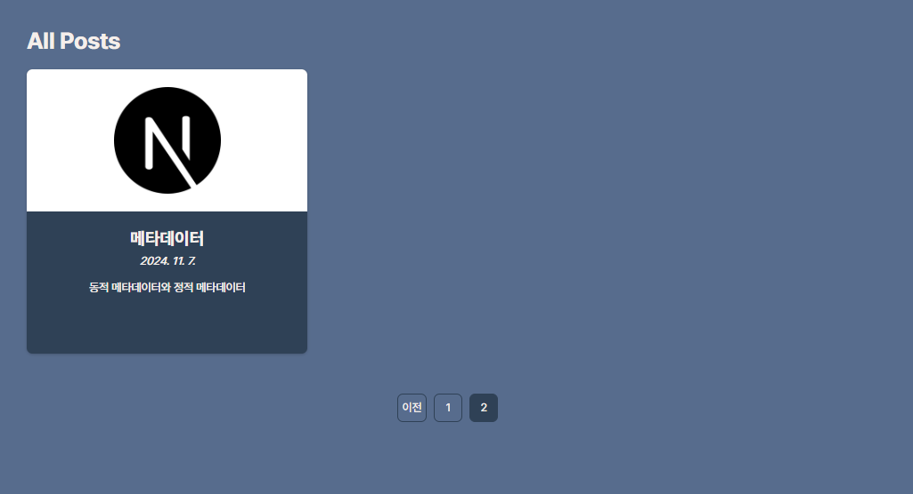
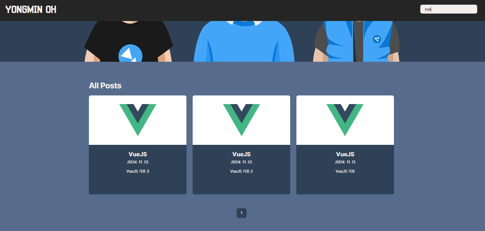
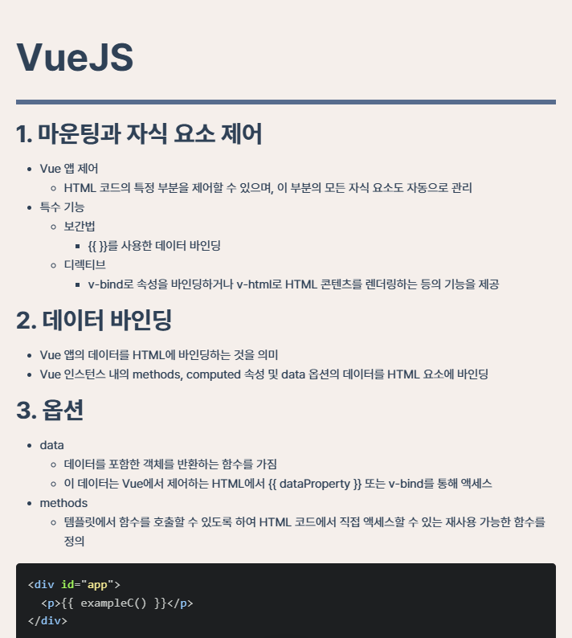

- 배포 URL: https://yongminoh-blog.vercel.app/


# 프로젝트 소개

이 블로그는 Next.js를 기반으로 구축되어, 최신 웹 기술과 빠른 페이지 로드를 지원합니다.
스타일링은 `sytyled-components`를 사용하여 컴포넌트 기반으로 구성되었으며, 직관적인 페이지네이션, 검색 기능 등이 포함되어 있습니다.

# 개발 환경

- Nextjs, JavaScript, Zustand, styled-components, vercel

# 개발 기간
- 2024-11-01 ~ 2024-11-07


# 파일 구조

```plaintext
├── .next                 # Next.js 빌드 출력 폴더
├── app                   # Next.js의 애플리케이션 라우팅 폴더
│   ├── api
│   │   └── posts         # API 라우트 폴더
│   │       └── route.jsx # 게시글 API 라우트
│   └── posts
│       ├── [slug]        # 개별 게시글 페이지
│       │   └── page.jsx  # 동적 게시글 페이지 파일
│       ├── post-detail.jsx
│       ├── icon.png
│       ├── layout.jsx
│       ├── not-found.jsx
│       └── page.jsx      # 메인 게시글 페이지
├── components            # UI 컴포넌트 폴더
│   ├── footer            # 푸터 컴포넌트 폴더
│   │   └── footer.jsx
│   ├── home-page         # 홈 페이지 관련 컴포넌트 폴더
│   │   ├── all-posts.jsx
│   │   └── main-image.jsx
│   ├── main-header       # 헤더 컴포넌트 폴더
│   │   ├── logo.jsx
│   │   └── main-navigation.jsx
│   └── posts             # 게시글 리스트 및 상세 페이지 관련 컴포넌트 폴더
│       ├── post-detail.jsx
│       ├── pagination.jsx
│       ├── post-grid.jsx
│       └── post-item.jsx
├── content               # Markdown 포스트 파일을 저장하는 폴더
├── node_modules          # 프로젝트 종속성 모듈 폴더
├── public                # 정적 파일 폴더
├── store                 # 상태 관리 폴더
│   └── posts-store.jsx   # Zustand를 이용한 상태 관리 파일
├── styled-components     # styled-components를 사용한 스타일링 폴더
├── .eslintrc.json        # ESLint 설정 파일
├── .gitignore            # Git 무시 설정 파일
├── image.png             # 프로젝트 이미지
├── jsconfig.json         # JavaScript 설정 파일
├── next.config.mjs       # Next.js 설정 파일
├── package-lock.json     # 종속성 잠금 파일
├── package.json          # 프로젝트 메타데이터 및 종속성 파일
└── README.md             # 리드미 파일

```

# 기능

- 빠른 페이지 로드: Next.js의 서버 사이드 렌더링으로 페이지 로드 속도가 빠릅니다.
- styled-components로 구성된 스타일링: 컴포넌트 단위로 스타일을 관리하여 코드 재사용성을 높였습니다.
- 페이지네이션: 포스트 목록을 페이지별로 나눠서 볼 수 있습니다.
- 검색 기능: 블로그 글을 쉽게 검색할 수 있습니다.
- Zustand를 이용한 상태 관리: 상태 관리를 위해 가벼운 상태 관리 라이브러리인 Zustand를 사용하여 전역 상태를 관리합니다.
- 직관적인 UI/UX: 사용자 친화적인 UI로 누구나 쉽게 사용할 수 있습니다.

## 게시물

  - md 파일을 작성하면 날짜 순으로 정렬하여 게시물을 6개까지 표시합니다.

## 페이지네이션

  - 게시물이 6개가 넘을 경우 페이지네이션 버튼을 통해 다음 페이지로 이동 가능합니다.

## 검색기능

  - 블로그 글과 일치하는 게시물을 필터링하여 보여줍니다.

## 게시물

  - 게시물을 클릭하면 상세 페이지로 이동합니다.
  - 마크다운 언어를 활용해 내용을 작성합니다.

